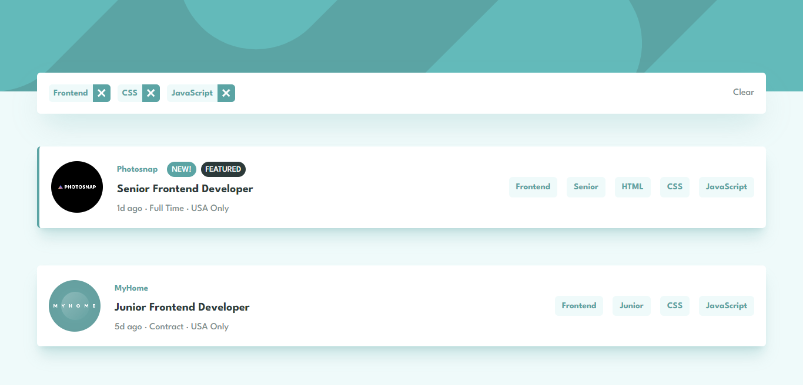

# Job Listings

<!-- screenshots here -->

A challenge from [frontendmentor.io](https://www.frontendmentor.io/)

## Overview

### Links

-   [Live Site](https://your-live-site-url.com)
-   [Solution](https://www.frontendmentor.io/profile/boedegoat)

<!-- ### The challenge -->

## My process

### Built with

-   Flexbox
-   Mobile-first workflow
-   Tailwind CSS
-   React

### Useful Resources

1. [Figma](https://www.figma.com/) - Paste your project design mockups to check the size, colors, etc.
2. [Vite](https://vitejs.dev/) - Next Generation Frontend Tooling

## Acknowledgments

Thank you very much to everyone who gave me feedback on my solution. It greatly assists me in improving my frontend development skills.
